# Informations

## On Progress...

Frontend Developer Challenge: YouTube Clone SPA

Working Prototype: https://youtube-spa.netlify.app

### Cloning Features:

1. YouTube Theme:
   - Dark
   - Light
2. Browsing, YouTube pages:
   - Home page
   - Results page
   - Watch page
   - Channel page
   - Watch later page
   - Liked videos page
   - History page
   - Library page
3. Cloning YouTube Queue.
4. Adding, removing and sorting and playing videos from watch later list, liked videos list and Queue.
5. Cloning YouTube filter bropdown and get playlists, channels, and videos on results page.
6. You can view a playlist on result's page (VIEW FULL PLAYLIST) link button.
7. Cloning all the Navigation bar Features:
   - Dropdowns
   - Autosuggestion Dropdown
   - Ability to remove suggestions
   - Fake Notifications

### Tech / Stack:

1. React (web framework).
2. State management with Redux.
3. React Helmet.
4. React Router.
5. SCSS.
6. module with SCSS.
7. Handling YouTuve v3 API requests with React axios and Redux thunk.
8. Using BEM (Block, Element, Modifier methodology) naming convention for classes in HTML5 and SCSS.
9. Using jest for unit testing.

## Screenshots:

#### Homepage - Light Mode:

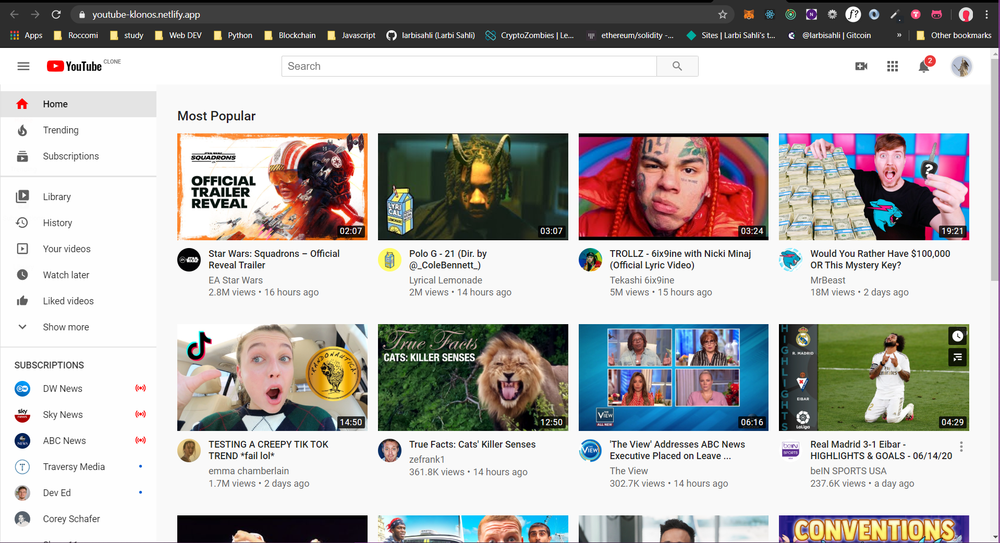

#### Homepage - Dark Mode:

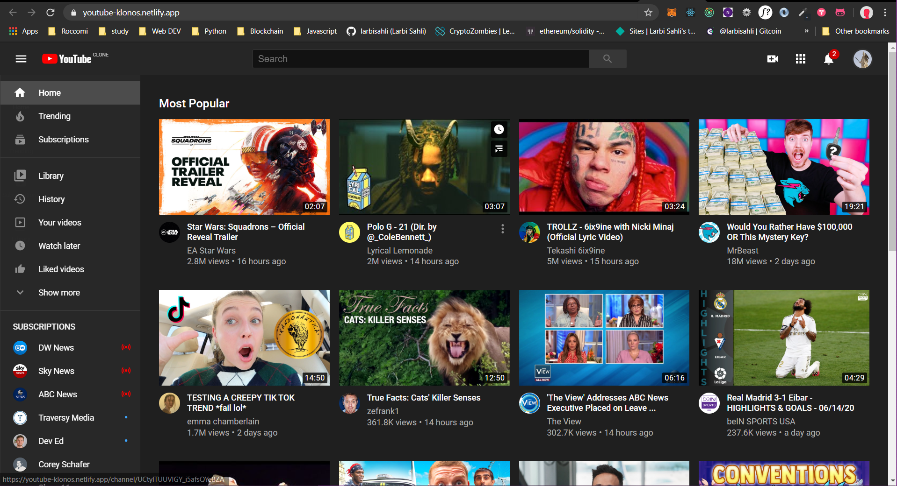

#### Responsive:

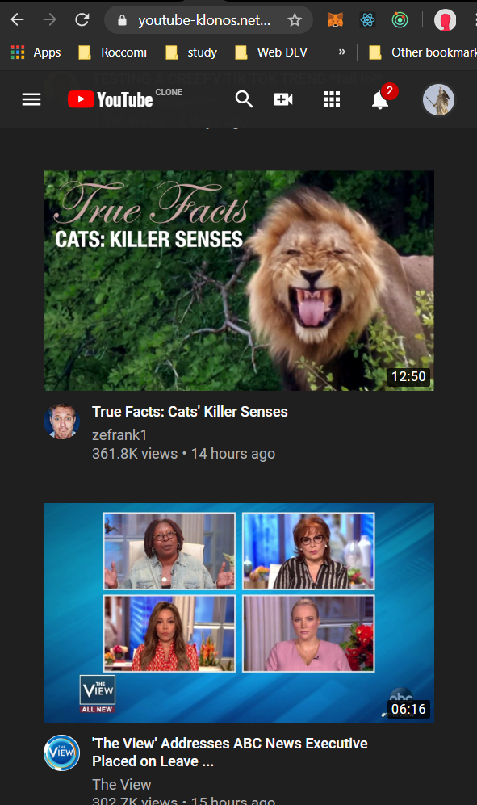

#### Watch Later Page:

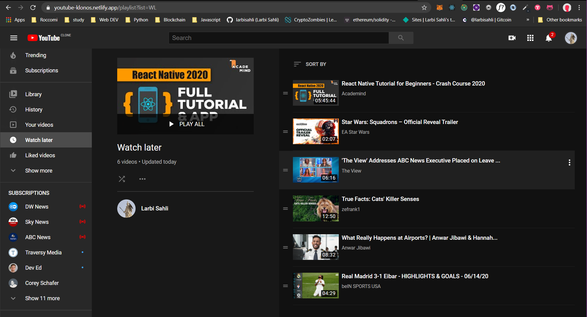

#### Queue:

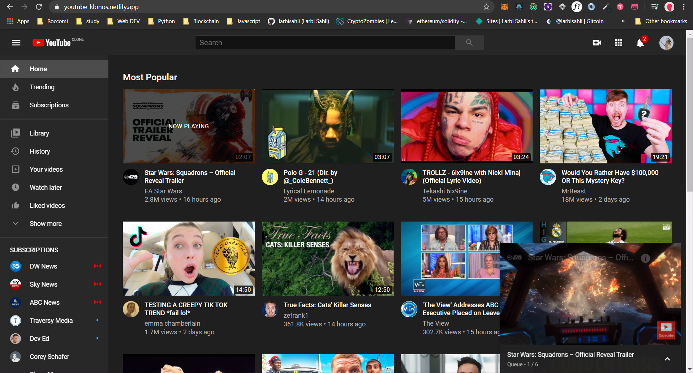

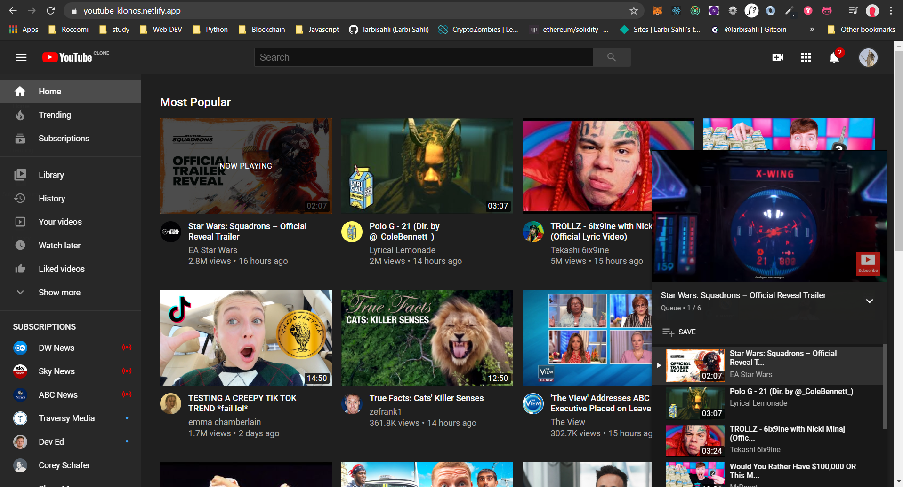

#### Search Page:

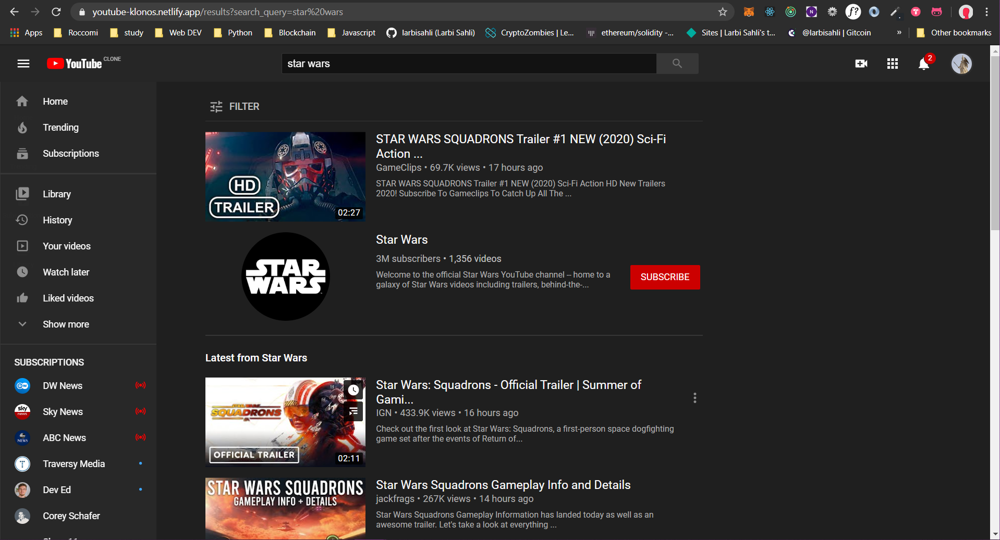

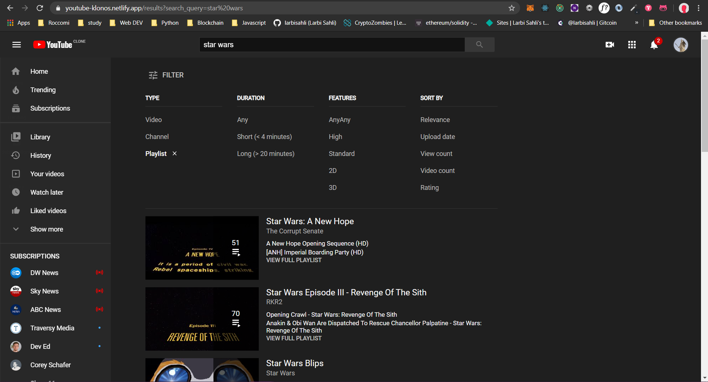

#### Watch Page:

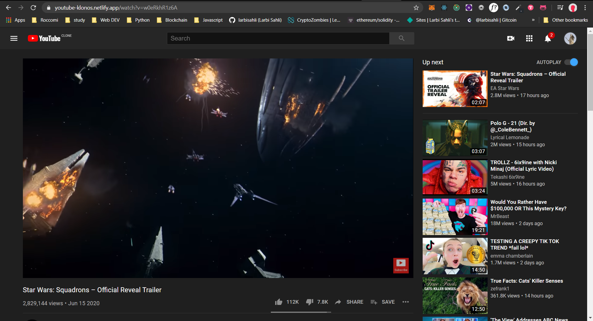

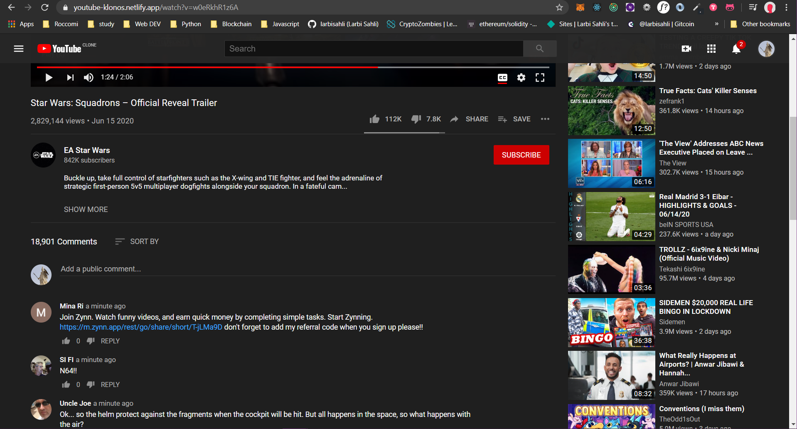

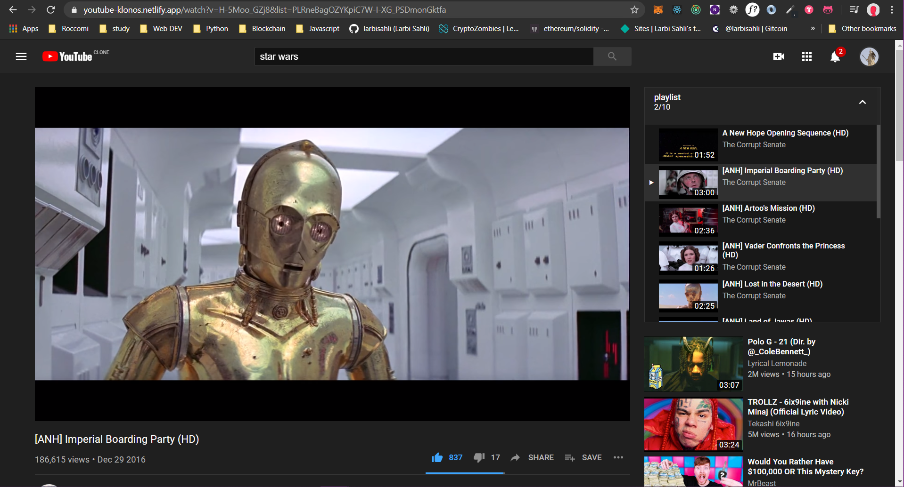

---

This project was bootstrapped with [Create React App](https://github.com/facebook/create-react-app).

### Available Scripts

In the project directory, you can run:

### `npm install`

### `npm start`

Runs the app in the development mode.
Open http://localhost:3000 to view it in the browser.

The page will reload if you make edits.
You will also see any lint errors in the console.
